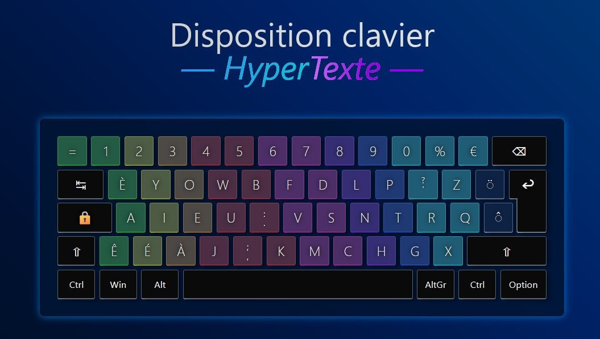
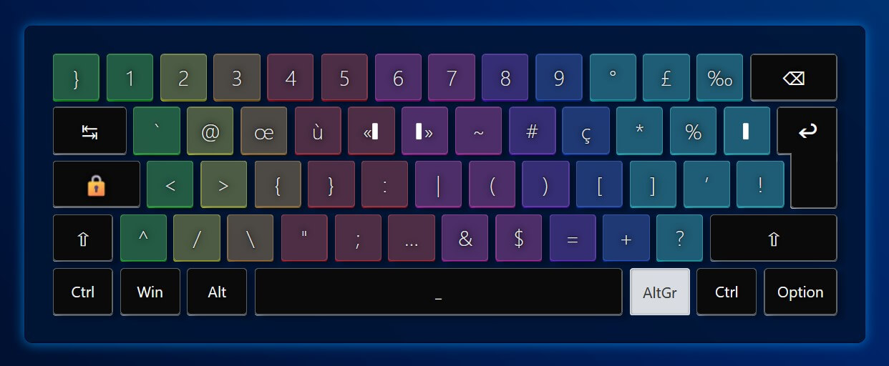
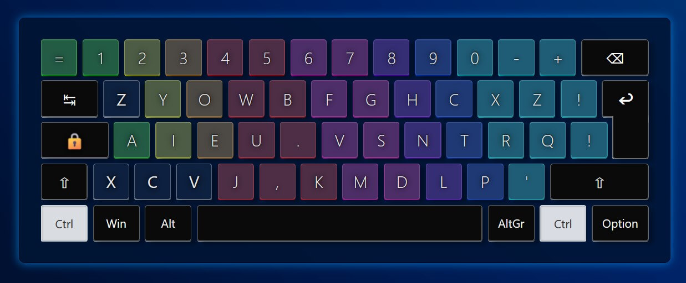
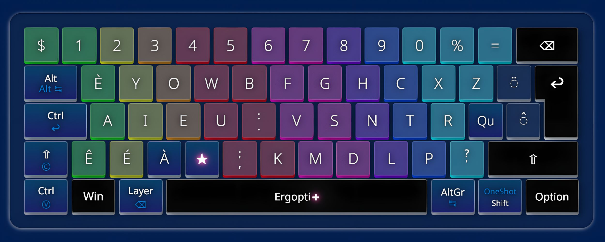

<div align="center">


# Ergopti

**An ergonomic keyboard layout optimised for French, English and code —
and Ergopti+, the free, 100 % local typing-automation suite that works on _any_ layout.**

[](https://github.com/adrienm7/ergopti/actions/workflows/ci.yml)
[](https://github.com/adrienm7/ergopti/releases/latest)
[](LICENSE)
[](https://ergopti.fr)

**[ergopti.fr](https://ergopti.fr)** — interactive demo, documentation, online emulator ·
**[ergopti.fr/ergopti-plus](https://ergopti.fr/ergopti-plus)** — the Ergopti+ tour

</div>

---

## Table of contents

- [The Ergopti layout](#the-ergopti-layout)
- [The Ergopti+ suite](#the-ergopti-suite)
- [Installation](#installation)
  - [Install the layout](#install-the-layout)
  - [Install Ergopti+](#install-ergopti)
- [Try it in your browser](#try-it-in-your-browser)
- [Repository layout](#repository-layout)
- [Development](#development)
  - [Website (SvelteKit)](#website-sveltekit)
  - [Windows driver (AutoHotkey v2)](#windows-driver-autohotkey-v2)
  - [macOS driver (Hammerspoon)](#macos-driver-hammerspoon)
  - [Linux driver (alpha)](#linux-driver-alpha)
  - [Tests and quality gates](#tests-and-quality-gates)
- [CI and releases](#ci-and-releases)
- [Website deployment](#website-deployment)
- [Contributing](#contributing)
- [License](#license)

---

## The Ergopti layout

An open-source keyboard layout designed to minimise finger travel and same-finger
bigrams while remaining immediately usable — numbers stay on the top row, and the
most common shortcuts (<kbd>Ctrl</kbd>+<kbd>A/C/V/X/Z</kbd>) stay on the left hand.



|                        |                                                                              |
| ---------------------- | ---------------------------------------------------------------------------- |
| **Languages**          | French · English · Code                                                      |
| **Platforms**          | Windows · macOS · Linux                                                      |
| **Numbers**            | Direct access on the top row                                                 |
| **AltGr layer**        | Programming symbols, logically placed                                        |
| **Special characters** | Full French typographic support (accented capitals, ligatures, punctuation…) |

**AltGr layer** — programming symbols grouped for memorability:



**Ctrl layer** — standard shortcuts preserved on the left side:



---

## The Ergopti+ suite

Ergopti+ is the companion software — a complete typing-automation layer that runs
on **any** layout (AZERTY, QWERTY, Bépo, …). The Ergopti layout unlocks extra
bonuses, but is entirely optional. Everything is **free, open-source, local-only,
with no account and no telemetry**.



| Feature                  |                                                                                                                                              |
| ------------------------ | -------------------------------------------------------------------------------------------------------------------------------------------- |
| **Hotstrings**           | ~3 000 ready-made corrections and expansions, plus your own — with the magic <kbd>★</kbd> key (`pex★` → `par exemple`, `el★e` → `elle`)      |
| **Local AI predictions** | Sentence completion and correction via Ollama or MLX (Apple Silicon), 110-model curated catalogue; optional remote APIs with encrypted keys   |
| **Tap-holds**            | 7 default dual-role keys (tap = action, hold = modifier) + a home-row navigation layer                                                        |
| **Trackpad gestures**    | 36 gesture slots + 3 continuous axes on macOS (10 slots on Windows)                                                                           |
| **Typing metrics**       | Local SQLite dashboards (WPM over time, delegated keystrokes, n-grams, heatmaps) + a floating live WPM widget                                 |
| **Fully configurable**   | 335 settings, 21 interface languages, every feature optional and toggleable from the menu                                                     |

The three drivers share a single source of truth (`static/ergopti_plus/_shared/`)
for hotstrings, the LLM catalogue, locales, menus and webview UIs — so Windows,
macOS and Linux behave the same by construction.

---

## Installation

Ergopti (the layout) and Ergopti+ (the software) install independently — use
either without the other, or both together for the maximum gain.

### Install the layout

Follow the per-OS instructions (installers, keylayout bundle, XKB files) at
**[ergopti.fr/utilisation](https://ergopti.fr/utilisation)**.

### Install Ergopti+

**→ Download from the [latest release](https://github.com/adrienm7/ergopti/releases/latest)**

**Windows — `ErgoptiPlus.exe`**

A compiled AutoHotkey v2 executable; the AHK runtime is embedded, nothing else to
install.

1. Download `ErgoptiPlus.exe` and double-click it.
2. On first launch, resources are extracted to `%LOCALAPPDATA%\Ergopti`.

**macOS — `ErgoptiPlus.app.zip`**

A self-contained app bundling Hammerspoon and Karabiner-Elements.

1. Download `ErgoptiPlus.app.zip`, unzip, move the app to `/Applications`.
2. Remove the quarantine flag (the app is not Apple-notarised yet):
   ```bash
   xattr -dr com.apple.quarantine /Applications/Ergopti.app
   ```
3. Launch it. On first run, Karabiner-Elements asks for a System Extension
   approval — required for key remapping.

**Linux — alpha**

The Linux driver (kanata + a Lua daemon) is feature-complete on paper but still
looking for its first real-world testers. Grab `kanata.kbd` from the release and
see [`static/ergopti_plus/linux/`](static/ergopti_plus/linux/) — feedback via
[issues](https://github.com/adrienm7/ergopti/issues) is very welcome.

---

## Try it in your browser

No install needed: **[ergopti.fr/utilisation#clavier_emulation](https://ergopti.fr/utilisation#clavier_emulation)**
emulates the layout (including the Ergopti+ magic key) directly on the website.

---

## Repository layout

```text
src/                      SvelteKit website (ergopti.fr)
static/ergopti_plus/      The Ergopti+ driver suite
  windows/                AutoHotkey v2 driver (entry: ErgoptiPlus.ahk)
  macos/                  Hammerspoon driver (entry: init.lua) + bundled apps
  linux/                  Lua daemon + kanata integration (alpha)
  _shared/                Cross-driver single source of truth
                          (hotstrings TOML, LLM catalogue, locales, menus, webview UIs…)
static/ergopti/           Ergopti layout artefacts (keylayout, XKB, XCompose)
static/drivers/           Driver support assets (alfred, espanso, kanata, kalamine)
tools/                    Build, codegen, lint and test tooling
docs/                     Engineering docs — start with docs/memory/README.md
```

---

## Development

### Website (SvelteKit)

Requires **Node 22.22+** (or 24.15+ / 26+).

```bash
git clone https://github.com/adrienm7/ergopti.git
cd ergopti
npm install
npm run dev            # dev server at http://localhost:5173
npm run dev -- --open  # …and open the browser
npm run build          # production build (static site)
npm run preview        # preview the production build
```

The keyboard visualiser is built from scratch: a 16×7 grid of empty keys filled
from JSON according to the geometry, the active layer, and whether Ergopti+ is
enabled.

### Windows driver (AutoHotkey v2)

Install [AutoHotkey v2](https://www.autohotkey.com/), then run the driver
straight from the clone:

```powershell
AutoHotkey64.exe static\ergopti_plus\windows\ErgoptiPlus.ahk
```

Source files are UTF-8 **with BOM** + LF — run `npm run test:ahk-encoding` after
editing `.ahk` files.

### macOS driver (Hammerspoon)

To iterate on the macOS driver from this clone without rebuilding the app:

1. Install stock [Hammerspoon](https://www.hammerspoon.org/) into `/Applications`.
2. From the repo root, run once:
   ```bash
   npm run install:hammerspoon
   ```
3. Launch Hammerspoon — the driver now boots from your local clone. After edits,
   press <kbd>Cmd</kbd>+<kbd>Ctrl</kbd>+<kbd>R</kbd> to reload.

The installer is idempotent; any pre-existing `~/.hammerspoon/init.lua` is backed
up first. **Don't run stock Hammerspoon and the bundled `ErgoptiPlus.app` at the
same time** — they compete for the same event taps.

### Linux driver (alpha)

The daemon lives in [`static/ergopti_plus/linux/`](static/ergopti_plus/linux/)
(entry: `ergopti_hotstrings.lua`, launcher: `bin/ergopti-hotstrings`) and pairs
with [kanata](https://github.com/jtroo/kanata) for tap-holds.

**Runtime — LuaJIT.** The test suite runs on any Lua (`npm run test:linux` probes
`luajit`, then `lua5.4`, then `lua`), but the daemon binds `/dev/uinput`,
`nanosleep` and `libayatana-appindicator` through FFI, so LuaJIT is what actually
runs it.

**1. Dependencies**

```bash
bash static/ergopti_plus/linux/install.sh             # deps, kanata, files, permissions, autostart
bash static/ergopti_plus/linux/install.sh --no-deps   # …same, minus the package installs
```

| Package                            | Without it                                                                     |
| ---------------------------------- | ------------------------------------------------------------------------------ |
| `luajit`                           | the launcher refuses to start                                                  |
| `libnotify` (`notify-send`)        | the launcher refuses to start                                                  |
| `libxkbcommon-tools` (`xkbcli`)    | the output layout cannot be read, so every replacement is pasted via the clipboard instead of typed |
| `libayatana-appindicator3`         | `--tray` has nothing to host the icon in                                       |
| `kanata`                           | no tap-hold and no layers; hotstrings still work                               |
| `lua-luv`                          | no inotify — the loop falls back to an FFI sleep and file watching to `stat()` polling |
| `lua-posix`                        | no `SIGTERM`/`SIGHUP` handlers, and no `stat()` polling to fall back on        |
| `lua-lgi`                          | no typing-speed pill and no WebKit2GTK windows                                 |
| `lua-filesystem`                   | existence checks fall back from `stat()` to opening the path                   |
| `lua-http`                         | nothing today — installed, required by no module                               |

`install.sh` installs every row except `libayatana-appindicator3`, whose package
name the tray adapter prints for your distribution the first time `--tray` cannot
bind it. Every Lua library is loaded through `pcall(require, …)`, so a bare box
starts and silently does less rather than failing.

**2. Permissions** — this is where people get stuck

The daemon reads `/dev/input/eventN` and writes `/dev/uinput`, and a normal user
may do neither. `install.sh` handles it; re-run just that part (after a kernel
update, say) with:

```bash
bash static/ergopti_plus/linux/install.sh --setup-perms
```

It adds you to **both** `input` and `uinput`, drops `uinput` into
`/etc/modules-load.d/`, and writes `/etc/udev/rules.d/99-ergopti-uinput.rules`:

```udev
KERNEL=="uinput", MODE="0660", GROUP="uinput", OPTIONS+="static_node=uinput"
```

`static_node=uinput` is **not** optional: `/dev/uinput` does not exist until the
module is loaded, so a rule without it matches nothing on a fresh boot and the
permissions look as though they were never applied. Log out and back in
afterwards — group membership is only read at session start. Note that `input`
grants read access to every keystroke of the session; that is what a hotstring
engine needs, and it is why `uaccess` is deliberately not used here.

**3. Run it from the clone**

```bash
cd static/ergopti_plus/linux
luajit ergopti_hotstrings.lua --dry-run    # log matches, inject nothing
luajit ergopti_hotstrings.lua --tray       # the real thing, with a tray icon
```

`bin/ergopti-hotstrings` does the same after exporting `LUA_PATH`, but it prefers
an installed tree if `/usr/lib/ergopti` exists — call the entry file directly
when iterating on a checkout. With no `~/.config/ergopti/hotstrings/`, the daemon
falls back to the TOML definitions bundled in `_shared/modules/hotstrings/`.

| Flag                       | Effect                                                                     |
| -------------------------- | -------------------------------------------------------------------------- |
| `--config <path>`          | TOML file or directory (default `~/.config/ergopti/hotstrings/`)           |
| `--device <path>`          | evdev device to listen on; auto-detected when omitted                      |
| `--layout qwerty\|azerty`  | INPUT layout, keycode → character (default: `$XKBLAYOUT`)                  |
| `--keymap <path>`          | OUTPUT keymap dump, for a session whose layout cannot be probed            |
| `--tray`                   | system tray icon                                                           |
| `--no-grab`                | observe instead of grabbing — physical keys then interleave with an expansion and can scramble it |
| `--dry-run`                | log matches without injecting                                              |
| `--verbose`, `-v`          | log at debug level for that run                                            |
| `--help`, `-h`             | usage                                                                      |

**4. Before trusting it on your own keyboard**

The driver is alpha and has never been validated on real hardware.
[`HARDWARE.md`](static/ergopti_plus/linux/HARDWARE.md) is the checklist for
everything CI cannot answer — capture under X11 and Wayland, the keymap dump, the
grab, the tray — and most of it is scripted:

```bash
bash static/ergopti_plus/linux/tests/hardware/validate.sh
```

### Tests and quality gates

| Suite                       | Command                                                             |
| --------------------------- | ------------------------------------------------------------------- |
| Site + cross-driver gates   | `npm run test:js`                                                   |
| macOS driver (Lua)          | `cd static/ergopti_plus/macos && lua tests/run.lua`                 |
| Windows driver (AHK)        | run `static/ergopti_plus/windows/tests/run_all.ahk` with AHK v2     |
| Linux driver                | `npm run test:linux`                                                |

House rules: every bug fix ships with a regression test, and the shared
constants between drivers are pinned by single-source parity tests — see
[docs/memory/README.md](docs/memory/README.md) for the accumulated engineering
knowledge.

---

## CI and releases

Every push to `main` or `dev` runs the unified [`ci.yml`](.github/workflows/ci.yml)
pipeline: validation gates (hotstrings, domain, JS, translations), the three
driver suites, then — once everything is green — automated SemVer release builds
for all platforms with an auto-generated changelog.

**Version bump** (from conventional commit types since the last tag):

| Condition                                          | Bump  |
| -------------------------------------------------- | ----- |
| Subject contains `BREAKING` or uses `!` (`feat!:`) | Major |
| At least one `feat:` commit                        | Minor |
| Only `fix:`, `perf:`, `refactor:`, …               | Patch |

**Channels:** `main` cuts stable releases (`v0.6.7`); `dev` cuts pre-releases
(`v0.7.0-dev.{run}`); a commit message containing `alpha`/`beta` selects those
channels.

---

## Website deployment

[`deploy-site.yml`](.github/workflows/deploy-site.yml) publishes the site to
GitHub Pages (branch mode, `gh-pages`) whenever site-relevant paths change:

| Branch | URL                                              |
| ------ | ------------------------------------------------ |
| `main` | [ergopti.fr](https://ergopti.fr)                 |
| `dev`  | [ergopti.fr/dev/](https://ergopti.fr/dev/)       |

Each push rebuilds only the pushed branch's subdirectory, so the two stay
independent.

---

## Contributing

Issues and PRs are welcome — in **English**, so everyone can collaborate.

- Read [CONTRIBUTING.md](CONTRIBUTING.md) and [AGENTS.md](AGENTS.md) (shared
  agent/tooling index) first.
- Commits follow [Conventional Commits](https://www.conventionalcommits.org/);
  `main` and `dev` keep a **linear history** (squash, no merge commits).
- Non-obvious lessons about the codebase belong in
  [docs/memory/README.md](docs/memory/README.md) so they never evaporate.

---

## License

[MIT](LICENSE) © Adrien MOYAUX
