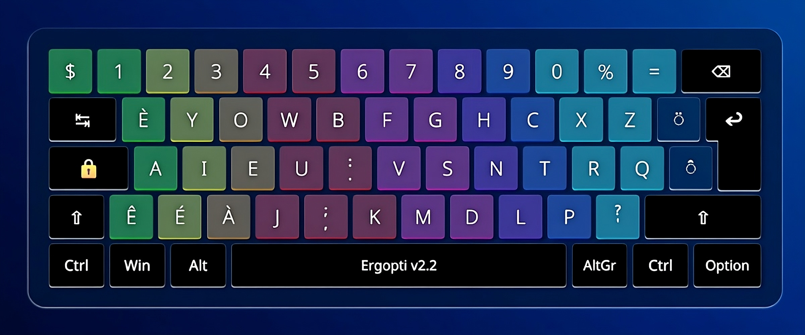
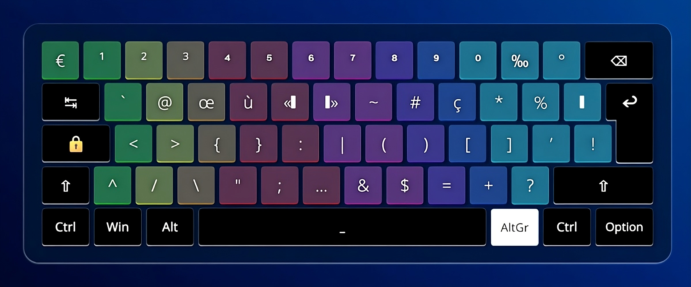
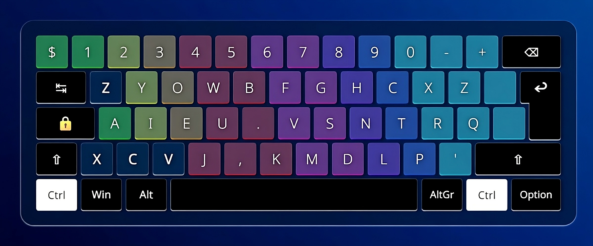
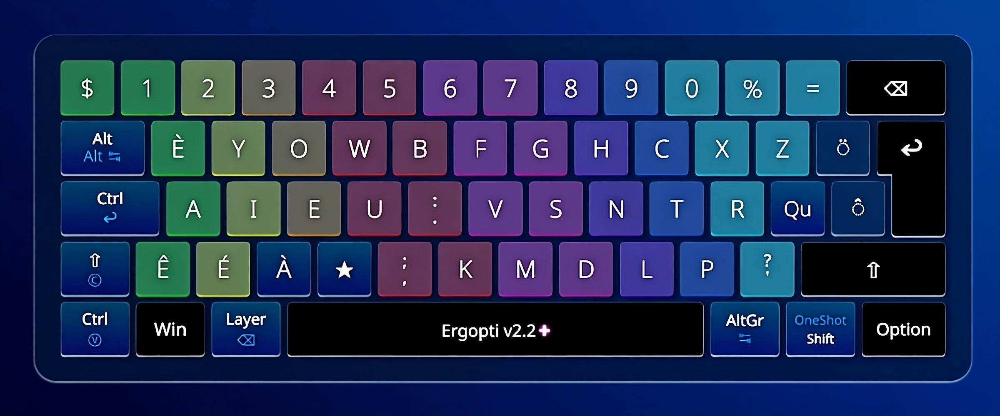

# Disposition Ergopti



---

➜ https://ergopti.beseven.fr

---

Ergopti est une disposition de clavier ergonomique et optimisée possédant les caractéristiques suivantes :

- Disposition **optimisée pour le français, l’anglais et le code** ;
- **Chiffres en accès direct** ;
- Couche AltGr permettant d’accéder aux symboles de programmation ;
  
- **Conservation de raccourcis usuels** : les raccourcis <kbd>Ctrl-{A, C, V, X, Z}</kbd> sont disponibles à gauche du clavier ;
  
- Support de tous les caractères spéciaux utilisés en français (diacritiques, majuscules accentuées, lettres entrelacées, symboles de ponctuation…) ;
- **Version « Ergopti + » avec de nombreuses autres fonctionnalités** :
  
  - touche ★ de répétition (par exemple <kbd>el★e</kbd> donne « elle ») ;
  - touche ★ d’abréviations (par exemple <kbd>pex★</kbd> donne « par exemple ») ;
  - suppression de tous les SFBs restants (par exemple <kbd>,s</kbd> donne « sc ») ;
  - la touche <kbd>q</kbd> donne « qu » ;
  - divers raccourcis dont des tap-holds ;
  - ajout de nouveaux roulements (par exemple <kbd>hc</kbd> donne « wh ») ;
  - etc.
 
➜ Il est possible d’essayer la disposition en ligne sur la page suivante : https://ergopti.beseven.fr/telechargements#clavier_emulation.

---

Le site de présentation du projet fonctionne à l’aide de [SvelteKit](https://kit.svelte.dev/).

---

## Génération des claviers

Les claviers sur le site ont été réalisés à partir de zéro, en créant une matrice de 16×7 touches vides.
Une fonction va ensuite remplir ces touches grâce aux valeurs d’un fichier json, selon la géométrie, la couche choisie, l’emplacement de la touche, si la version Ergopti+ est activée, etc.

Le code de génération de ces claviers est fait sur-mesure pour mes besoins (nouvelles couches telle qu’une couche Layer, une couche Indices, Exposants, etc.) mais pourrait probablement être utilisé sur un autre projet moyennant des adaptations. En particulier, il faudrait voir comment faire pour utiliser la fonction de génération de clavier en dehors de SvelteKit.

## Développement

Après avoir cloné le projet, se placer dans le répertoire ergopti.
Puis, installer les dépendances :

```bash
npm install  # ou pnpm install ou yarn
```

Une fois cela fait, démarrer un serveur de développement avec la commande suivante :

```bash
npm run dev
```

Cela devrait ouvrir un serveur local à l’adresse http://localhost:5173/.

Il est également possible de démarrer le serveur et d’ouvrir automatiquement l'application dans un nouvel onglet de navigateur :

```bash
npm run dev -- --open
```

## Build

Pour créer une version de production de l'application, utiliser :

```bash
npm run build
```

Une fois cela fait, pour prévisualiser la version de production, exécuter :

```bash
npm run preview
```

### Déploiement

Pour déployer l'application, il peut être nécessaire d'installer un adaptateur en fonction de l'environnement cible.
